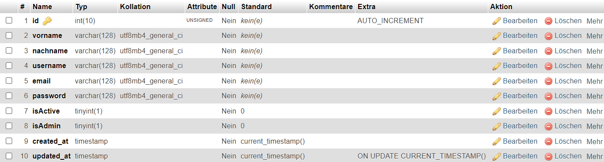

# Login-System PHP
## with MySQLi procedural connection to MariaDB (MySQL)

### Structure:
- Welcome Page
- Sign In Page
- Sign Up Page
- Profile Page
- Logout Page (with automatic redirection to Welcome Page)

### TechStack:
- PHP 8.2.4
- MariaDB 10.4.28
- Xampp Control Panel V3.3.0
- everything developed on localhost with Xampp and PhpStorm

### Database Structure:

### Styling:
- Just a CSS Reset from https://www.joshwcomeau.com/css/custom-css-reset/
- plus a little bit additional styling from myself with support from W3Schools
- Styled just for desktop view, could look online good as well, but is not tested

### Security:
- Passwords are hashed with PHP's password_hash() function
- Passwords are checked with PHP's password_verify() function
- SQL Injections are prevented with prepared statements
- when accessing profile page via url entry, the content will not be shown